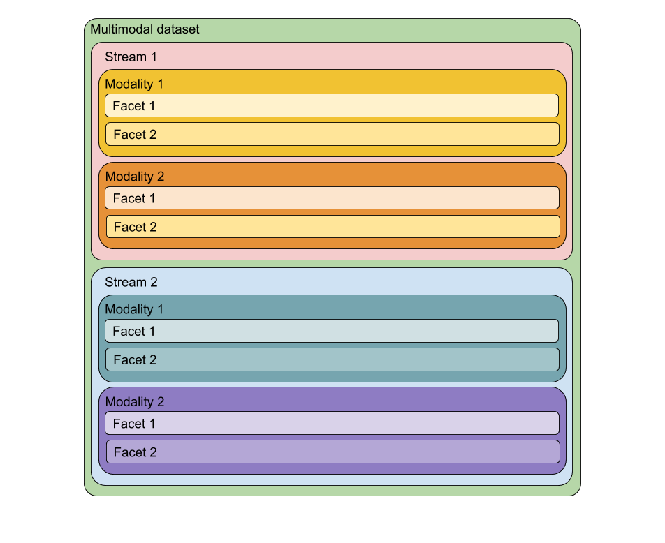
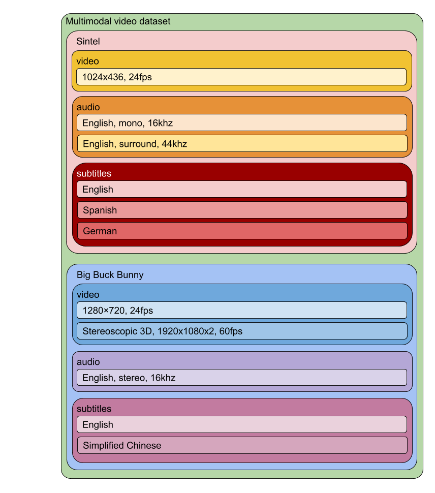

# MULTIMODAL DATASET

This package contains modules for handling multimodal data, with a focus on video with audio and subtitles.

## Requirements
The package relies on the packages:
 - `h5py`
 - `numpy`
 - `imageio`.

If you use Anaconda, these are most likely installed by default, otherwise you have to install them.

For converting movies to datasets, you will need `ffmpeg-python`. There are many python ffmpeg interfaces, make sure you use [ffmpeg-python](https://github.com/kkroening/ffmpeg-python). 
You will also need a ffmpeg binary installed on your system.

To run the demo (see below) you will also need the `requests` package, 
alternatively you can download the Sintel files manually. 
Step 3 in the demo also requires `scipy` to be installed.

## Installation
In the base project directory, run:
```text
$ python setup.py develop
```
This will add symbolic links in your local python distribution to this package, which will 
update  when you pull new changes.

## Anatomy of multimodal video datasets
At it's core, the multimodal datasets are HDF5 files, where the root group gathers all the different modalities for a 
single multimodal stream (e.g. a movie). 
Generally, the modalities can be anything, but specialized classes have been implemented for dealing with video, audio and 
subtitles.
A single multimodal stream (a root group of the HDF5 file) can have multiple modalities, for the movie case this
corresponds to the stream of images, sound and subtitles. These modalities are groups of the stream. Each modality in 
turn can have different "facets". A facet is a way of viewing the same modality. In the case of movies, the image 
modality could have different facets such as different camera angles of the same scene, the audio facets could 
correspond to different language audio streams and subtitle facets could correspond to different closed captioned 
languages.
Visually, the layout of general multimodal datasets looks like this:


For video datasets, we can illustrate how the general dataset is used like this


A facet can also be the result of online processing of some other facets (such as resampling an audio facet or resizing 
a video facet), but these are not represented in the HDF5 and are specific to the facet handler implementation.


## Usage

### Creating multimodal datasets
The package contains a script to convert .mp4 files (using ffmpeg) and accompanying SubRip subtitles files into HDF5 
datasets where all frames of the video-stream are saved as individual images (to enable precise slicing) and the audio 
together with the audio and subtitles of the video.   

To convert videos, use the script `bin/make_multimodal_dataset.py`. The script supports two modes of operation: 1) supplied with a single MP4 file and one or more SRT subtitle files, it will combine them into a single dataset or 2) 
given a video-index produced by `bin/make_video_index.py`, all videos in the index will be converted (optionally in parallel). 

1. Single video file:
    ```text   
    $ python bin/make_multimodal_dataset.py PATH_TO_MP4 [[PATH_TO_SRT_1] ... PATH_TO_SRT_N]
    ```
    This will create a HDF5 file using the same base name as the video file with an `.h5` extension.

2. Using a video-index:
    Alternatively, the tool takes a video-index file as input which specifies which file and subtitles should be converted. 
    This file is a JSON file produces by the `bin/make_video_index.py` script.
     

### Using multimodal datasets
The methods for using multimodal datasets are located in the multimodal package. 

## Demo
A demo of how to use the datasets can be found in the `bin/extract_subtitle_audio.py` script. First you need a 
multimodal video dataset to work with. For this purpose we will download the free Sintel movie and subtitles. After 
installing the package (see above), do the following:

0. Install required software, `ffmpeg`, `ffmpeg-python`:
   
   i. ffmpeg:
      
      Debian/Ubuntu 
      ```text   
      $ sudo apt-get install ffmpeg
      ```
      
      Anaconda:      
      If you use Anaconda, you can install a python-local ffmpeg binary which doesn't require superuser privilege:
      ```text   
      $ conda install ffmpeg
      ```
            
   ii. Python packages: 
      ```text   
      $ pip install ffmpeg-python
      ```
      
1. Download the dataset:
   ```text
   $ mkdir -p data && cd data && python ../bin/download_sintel.py
   ```
   This will download the free movie [Sintel](https://durian.blender.org/) along with english subtitles and place them in the `data/` directory.
   If you don't have the python `requests` package, you can download the movie and subtitles manually from the above link.

2. Convert the movie and subtitle to a multimodal dataset, in the directory `data/`:
   ```text
   $ python ../bin/make_multimodal_dataset.py sintel-1024-surround.mp4 sintel_en.srt
   ```
   This will make a HDF5 multimodal dataset from the movie and subtitles, the dataset will have the same name as the video, but with the extension .h5 instead of .mp4

3. Make a directory for the wave files and run the extraction script:
   ```text
   $ mkdir -p sintel_waves && python ../bin/extract_subtitle_audio.py sintel-1024-surround.h5 sintel_waves
   ```
   If you get a numpy float deprecation warning, everything is still allright.

The directory `data/sintel_waves` will now contain wav files named by the subtitle text containing the corresponding audio.

## Batched data
The datasets doesn't support batched data yet, since this will 
require packing and padding of sequences. This is on the todo-list.